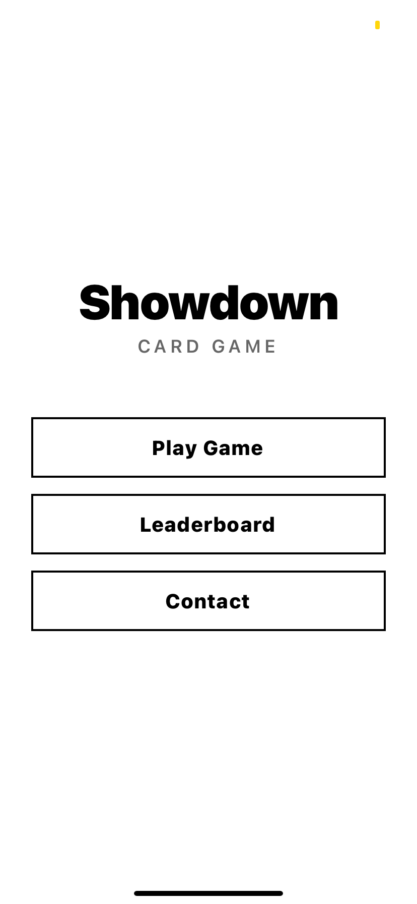
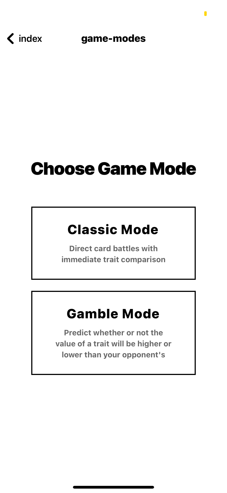
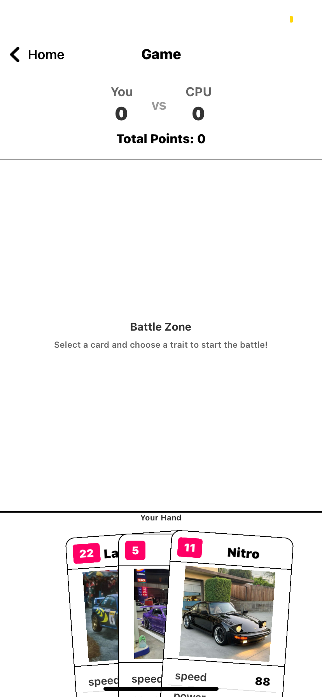
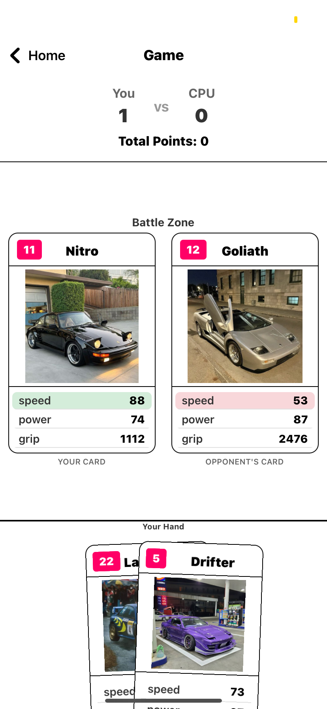
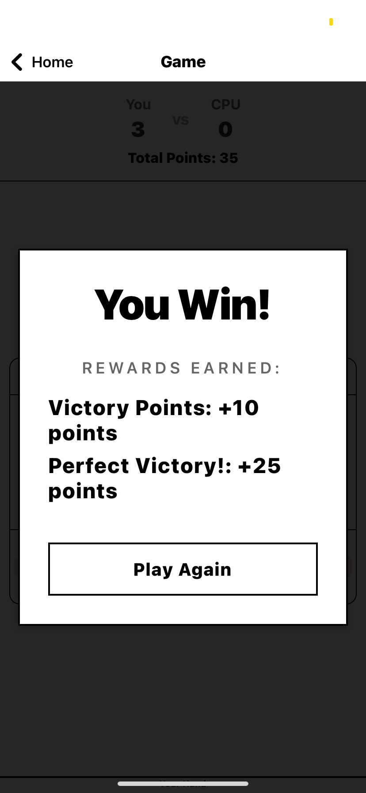

# expo-react-native

(｀・ω・´) **Showdown: Card Battle Game** 

A React Native card battle game where players compete with unique car cards! ＼(≧▽≦)／

## 🎮 Game Screenshots

The game features several distinct screens and gameplay modes:

### 📱 **Title Screen**

- Main menu interface with game title and navigation options
- Clean, modern design with "Compare" branding
- Entry point to the game experience

### 🎯 **Game Modes Selection**

- Mode selection screen allowing players to choose between:
  - **Classic Mode**: Traditional card battle gameplay
  - **Gamble Mode**: Prediction-based card game with trait guessing
- Intuitive interface for game mode selection

### ⚔️ **Classic Gameplay**


- Core battle mechanics in action
- Shows card selection, trait comparison, and battle results
- Displays player hand, CPU opponent, and scoring system
- Real-time gameplay with interactive card fan and battle zone

### 🏆 **Victory Screen**

- Game over overlay with final results
- Displays winner announcement and final scores
- Shows rewards earned and "Play Again" option
- Animated victory celebration

### 📊 **Leaderboard**

- Global leaderboard integration with Supabase
- Shows player rankings, scores, and statistics
- Pull-to-refresh functionality for real-time updates
- Anonymous username system for privacy

## System Design ⚙️

### Core Architecture (⌐■_■)
- React Native + Expo
- TypeScript for type safety
- Expo Router for navigation

### Game Engine ヽ(°〇°)ﾉ
- Factory pattern for game state management
- Battle tracker system for match history
- Reward system with point calculations

### Data Flow (｀･ω･´)ゞ
```
GameStateFactory → GameScreen → Battle Components
         ↓              ↓             ↓
    State Logic    UI Rendering    User Input
         ↓              ↓             ↓
   Battle Logic  ←  Game Flow   ← Player Actions
```

### Components (◕‿◕✿)
- `CardFan`: Interactive card selection
- `BattleCard`: Card display and animations
- `GameOverlay`: Battle results and rewards

### State Management (｀_´)ゞ
- Local state with React hooks
- AsyncStorage for persistence
- Supabase for leaderboards

### Battle System ᕦ(ò_óˇ)ᕤ
- 3 key attributes: Speed, Power, Grip
- Turn-based gameplay
- CPU opponent AI

## Work in Progress ⚡️

More exciting features coming soon! (ﾉ◕ヮ◕)ﾉ*:･ﾟ✧